## **Medled**
#### Medicine app for **"Hack Heroes"** Competition :raised_hands:

A few resources to get you started if this is your first kotlin project:
- [kotlin docs](https://kotlinlang.org/docs/tutorials/getting-started.html)
- [kotlin codelabs](https://codelabs.developers.google.com/android-kotlin-fundamentals/)

 :shopping_cart: :point_right: [Find app on playstore](https://github.com/F-Y-E-F/medled/tree/feature/make_graphic_project_in_adobeXd)  :point_left: :shopping_cart:\
:film_strip: :point_right: [App guide video](https://github.com/F-Y-E-F/medled/tree/feature/make_graphic_project_in_adobeXd)  :point_left: :film_strip:

### App branches :

| Branch Name | Commits Count | Link |
| :---:         |     :---:      |         :---: |
| feature/make_graphic_project_in_adobeXd   | 14     | [feature/make_graphic_project_in_adobeXd](https://github.com/F-Y-E-F/medled/tree/feature/make_graphic_project_in_adobeXd)   |
| feature/authentication   | 53     | [feature/authentication](https://github.com/F-Y-E-F/medled/tree/feature/authentication)   |
| feature/setup_room_database   | 33     | [feature/setup_room_database](https://github.com/F-Y-E-F/medled/tree/feature/setup_room_database)   |
| feature/setup_realtime_database   | 60     | [feature/setup_realtime_database](https://github.com/F-Y-E-F/medled/tree/feature/setup_realtime_database)   |

### Used Techology:

- kotlin navigation component :compass: [link](https://developer.android.com/guide/navigation/navigation-getting-started)
- kotlin room database :rocket: [link](https://developer.android.com/training/data-storage/room)
- kotlin coroutines :iphone: [link](https://kotlinlang.org/docs/reference/coroutines-overview.html)
- android firebase authentication :fire: [link](https://firebase.google.com/docs/auth/android/start)
- android firebase realtime database :fire: [link](https://firebase.google.com/docs/database/android/read-and-write)

### App features :
- [x] Save medicines and notify in the correct time
- [x] Chat with doctors
- [x] Change user profile data 
- [ ] Verify doctors and star it work

### App guide :

- #### First you need to login or register

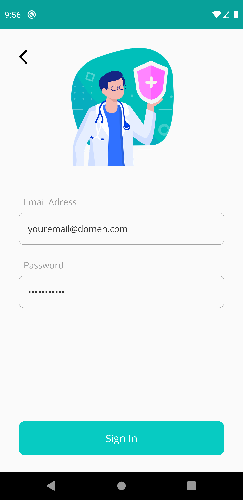
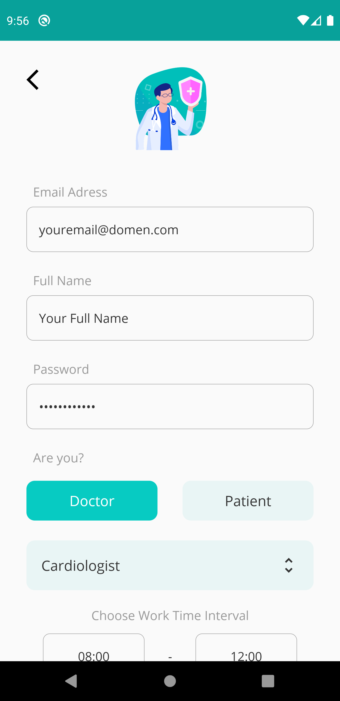

- #### Add medicine
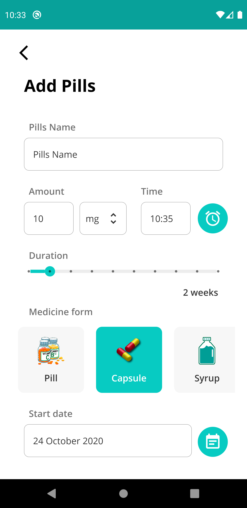
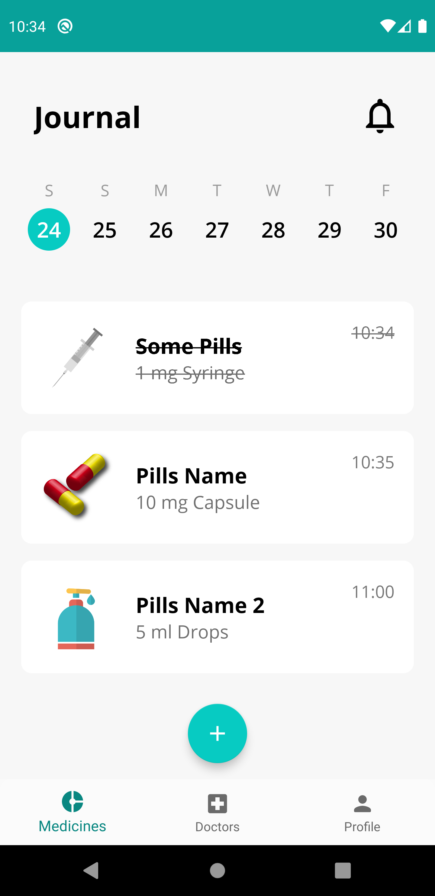

- #### Find doctors
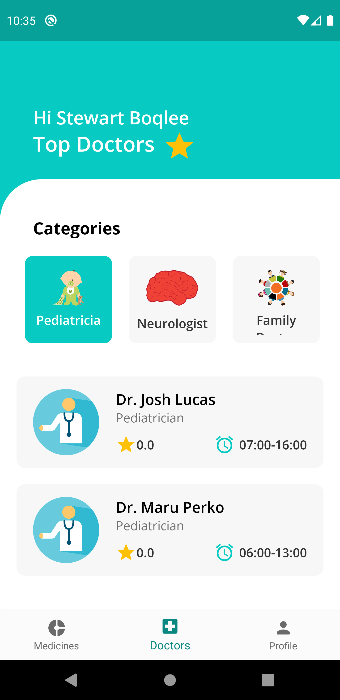
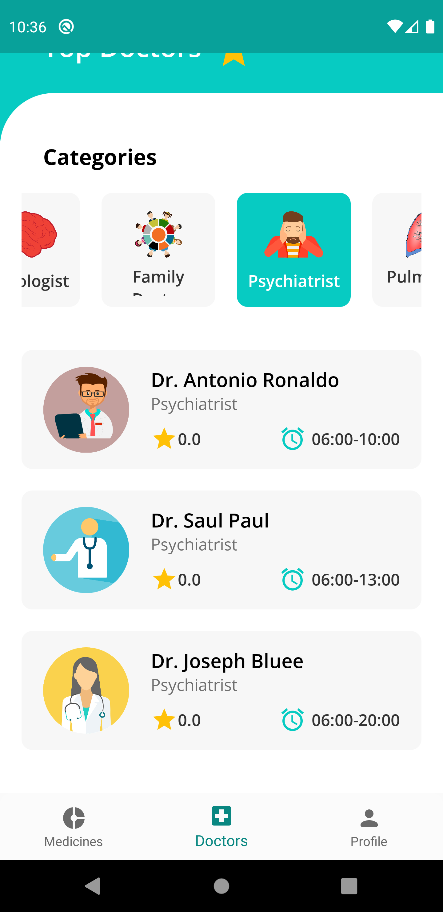
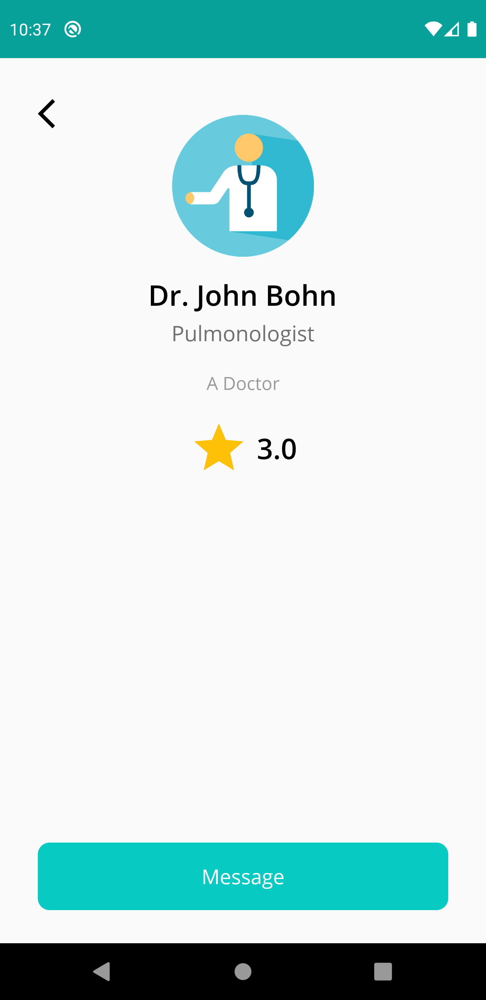	

- #### Message with doctor
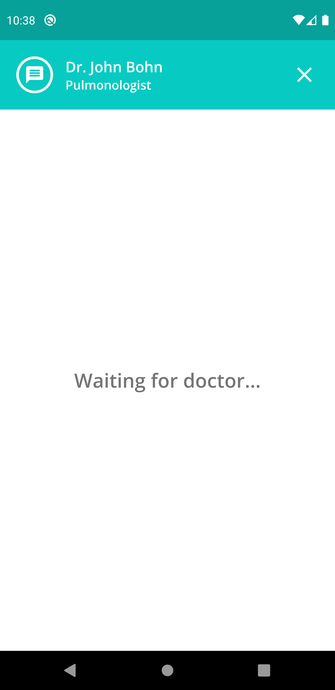	
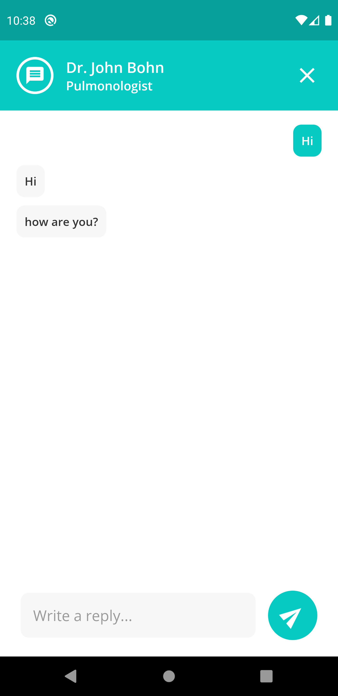	

- #### Change profile settings
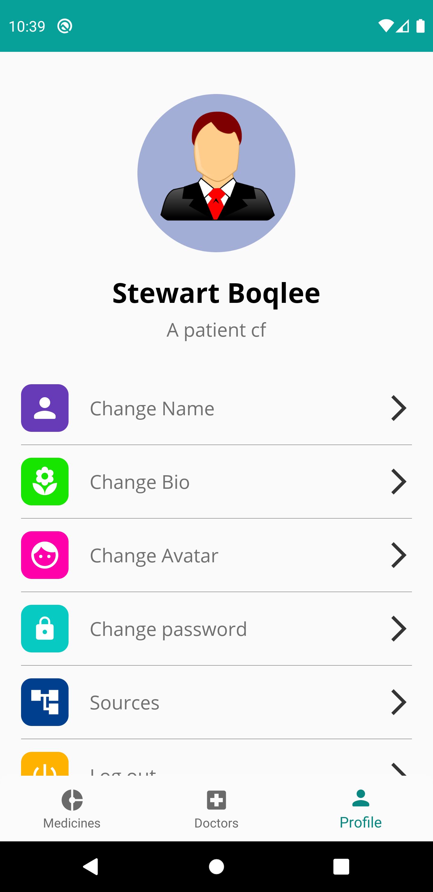	
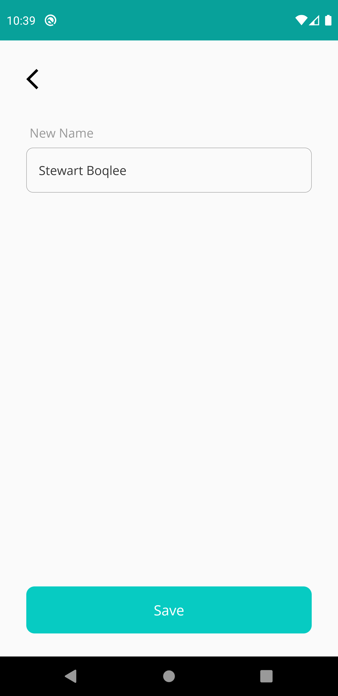	

### Doctor perspective :

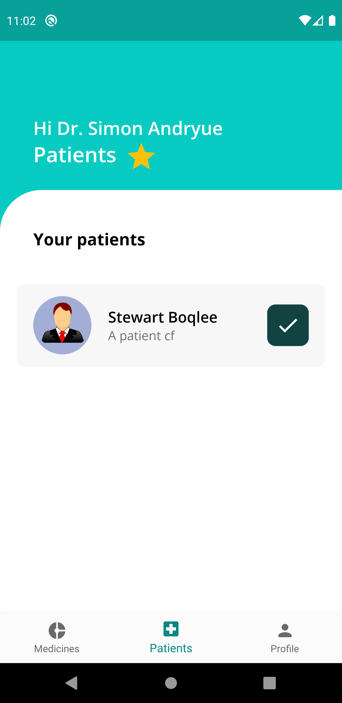	
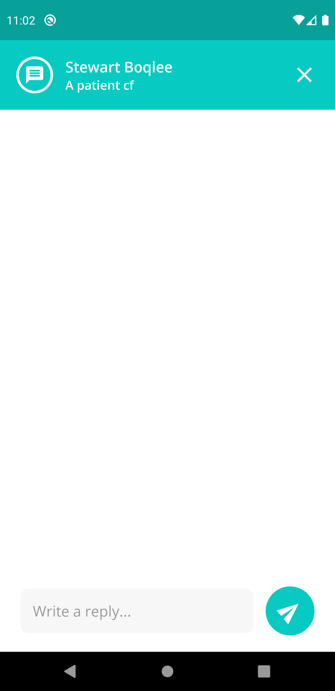	
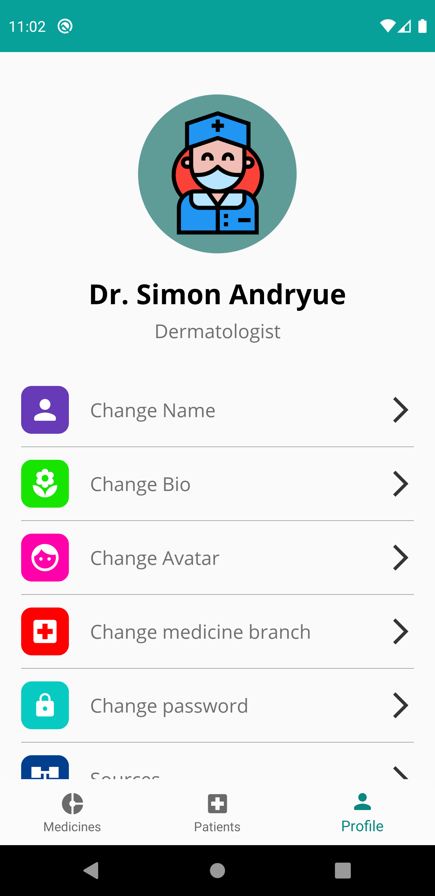	

